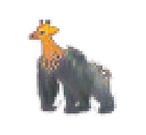

# Open-ended creation of hybrid creatures with Neural Cellular Automata

This is our submission to the [Minecraft Open-endedness challenge
2021](https://evocraft.life/) for the Gecco conference.

## Description

Our algorithm is based on Neural Cellular Automata (NCA), a CA-based neural
network model inspired by morphogenesis. We chose to work with cellular
automata, as we're interested in models where complexity can be spontaneously
increasing over time, which is a property that traditional models (like neural
networks) do not have. We train a NCA to grow different patterns from various
seeds (or "genomes") in 2 or 3 dimensions. Once the training is done, we load
the model in Minecraft and have players modify the genomes. They can be mutated
or merged to create an endless stream of novel growing patterns. The resulting
patterns depend both on the genome and the growth rules learned offline by the
NCA, which can be unpredictable and surprising.

The repository contains link to pre-trained models in 2D and 3D as well as Colab
notebooks links to train you own NCA. 

The current codebase is very simplistic and therefore not very usable, because
that's only what I needed to run my experiments and try several things. I plan
to make it more usable in the near future.

## Usage

Make sure you have the right Python packages installed. The project uses Poetry,
so you only need to do `poetry install` if you have it.

Otherwise `pip install -r requirements.txt` should work too. 

Make also sure that you have installed the [Evocraft Python interface to
Minecraft](https://github.com/real-itu/Evocraft-py) and your Minecraft server is
started with `java -jar spongevanilla-1.12.2-7.3.0.jar`.

The Pytorch models are defined in `evo_ca/models.py`.

To run a 2D model in Minecraft, use `python run_2d.py <PATH>`. For a 3D version
use `python run_3d.py <PATH>`, replacing `<PATH>` with a path to your model
weights.

## Model weights
### Pre-trained models
The pre-trained weights are in a zip archive that you can download
[here](https://drive.google.com/file/d/1zLyXiFTJEi7wCDK7NHZOR7kg0fT_GE_w/view?usp=sharing).
Unzip the archive in the repo root.

### Train your own
You can also train your own models with different target patterns in both 2D and
3D in the Colab notebooks

#### 2D Model
[Colab link](https://colab.research.google.com/drive/1WEYtcDMm3HNfHHlso_B9SkDU0NivwXbv?usp=sharing)

#### 3D Model
[Colab link](https://colab.research.google.com/drive/1BDCJYv0245F5hJ4l1xgl-D8qkw8t0jgO?usp=sharing)
